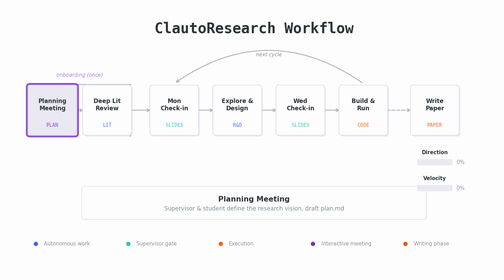

# ClautoResearch

An AI Scientist built entirely on Claude Code. No frameworks, no multi-LLM orchestration — just Claude as a PhD student, you as the supervisor.

## How It Works



You give Claude a research topic. Claude works in **R&D cycles**, checking in with you via **LaTeX slide decks** — exactly like a PhD student meeting their supervisor twice a week. You review, redirect, and approve at each step. Nothing happens without your sign-off.

Each cycle:

```
Mon morning: Check-in slides
  Present results from last Wed→Sun
  Discuss plan for Mon-Tue exploration

Mon → Tue: Exploration
  Literature, prototyping, thinking
  Student has autonomy

Wed morning: Check-in slides
  Present Mon-Tue findings
  Sign off on Wed→Sun execution plan

Wed → Sun: Execution
  Build, run experiments, collect results
  Approved plan is append-only
```

**Direction** (0-100): How defined is the research question? Start broad, narrow over time.
**Velocity** (0-100): How fast are we moving? Start slow (reading/thinking), accelerate as direction solidifies.

When results are ready, a separate **writing phase** drafts the paper — and can drop back into R&D when gaps appear.

## Install

ClautoResearch is a Claude Code plugin. Install it once, use it in any project.

**Prerequisites**: [Claude Code](https://claude.com/claude-code) installed, `pdflatex` available.

```bash
# Add the marketplace
claude plugin marketplace add murnanedaniel/ClautoResearch

# Install the plugin
claude plugin install clauto-research
```

## Start a Project

```bash
mkdir my-research && cd my-research
claude
```

Then type:

```
/clauto-research:new-project "Your research topic"
```

That's it. Claude scaffolds the project, collects your tool preferences, and starts a planning meeting. From there, it works through the R&D cycle steps and automatically produces slide decks at each gate for your review.

Two commands:
- `/clauto-research:new-project "topic"` — scaffold a new research project
- `/clauto-research:write` — switch to paper-writing mode (when you're ready)

Everything else (literature search, experiment design, coding, running studies, producing check-in slides) happens naturally as Claude follows the workflow.

**Hooks** enforce the workflow: a **check-in hook** ensures slides are produced at gate points, and a **stop hook** keeps Claude working autonomously through entire phases — it can only stop when slides are ready for your review. The student always shows up with a deck, and never pauses to ask "shall I continue?"

## Project Structure

Each project is a standalone directory:

```
my-research/
├── CLAUDE.md            # System instructions + project-specific context
├── state.yaml           # Current cycle/step/direction/velocity
├── plan.md              # Long-running project plan (north star)
├── templates/           # Slide deck & notes templates (from plugin)
├── requirements.txt     # Pinned Python dependencies
├── src/                 # Persistent code (promoted from cycles)
│   ├── data/            # Data loading, preprocessing
│   ├── models/          # Model definitions
│   └── utils/           # Shared utilities
├── literature/          # Project-specific references
├── cycles/              # cycle_01/, cycle_02/, ...
│   └── cycle_NN/
│       ├── notes.md     # Cycle scratchpad (from template)
│       ├── slides/      # Check-in PDFs
│       ├── code/        # Experiments (notebooks early, scripts later)
│       └── results/     # Outputs, plots, metrics
└── paper/               # Paper drafts (writing phase)
```

## Plugin Structure

For contributors — this is what the plugin contains:

```
ClautoResearch/
├── .claude-plugin/          # Plugin manifest & marketplace
├── hooks/hooks.json         # Hook event bindings
├── scripts/                 # Hook enforcement scripts
├── skills/                  # /new-project, /write
├── instructions/system.md   # System instructions (written to project CLAUDE.md)
├── templates/               # LaTeX Beamer template, cycle notes template
├── literature/              # Landscape review of AI scientist systems
└── assets/workflow.gif
```

## Design Philosophy

- **Claude-native**: Uses Claude Code skills, hooks, and plugin system — not a Python orchestration framework
- **Supervisor in the loop**: Every phase gate is a slide deck review. No auto-approve mode
- **Minimal by design**: One model, two slash commands, four hooks
- **Real research workflow**: Modeled on how PhD advisors actually mentor students, not on pipeline diagrams

## License

MIT
